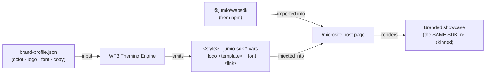

# Architecture & Setup — how the pieces fit 🧩

> Read this to understand *where the WebSDK comes from*, *what the playground is for*, and *what
> actually happens when we "style the SDK."* It's the clean mental model the whole prototype rests on.

## TL;DR

- **npm** (`@jumio/websdk`) = the SDK **runtime** — we *consume* it.
- **The websdk-playground** = our **reference manual + sandbox** — we *read patterns from it locally*, we do **not** copy it into this (public) repo.
- **This repo** = our **new code** (engine, microsite, studio) + **facts we've abstracted** (the reference doc, the schema).
- **`brand-profile.json`** = the **input to the theming engine**. The engine turns it into styling that is
  *injected into* the page where the npm SDK runs. **Same SDK, re-skinned at runtime — never a fork or rebuild.**

## The three layers

| Layer | What it is | Where it lives | We… |
|---|---|---|---|
| **Runtime** | `@jumio/websdk` | npm | install & import it |
| **Reference / sandbox** | `websdk-playground` (company repo; we have a zip snapshot now, can clone the real one later) | each builder's machine, **local only** | read patterns, prototype, mock — don't republish |
| **Our project** | engine · microsite · studio + docs | **this public repo** | build here, consume the runtime |

## The data flow (this is the whole product)

**One SDK → unlimited branded showcases.** Feed a different `brand-profile.json`, get a different-looking
page — with no change to the SDK package itself.

## What we reuse from the playground (the "intelligence")

The npm package is only the runtime. The playground is where the *know-how* lives — but most of it we
**reference**, not copy:

| From the playground | Comes from npm? | How we use it |
|---|---|---|
| WebSDK runtime | ✅ `@jumio/websdk` | consume |
| Design tokens (`variables.scss`) | ❌ | already abstracted → [`customization-reference.md`](./customization-reference.md) |
| Embedding patterns (`websdk-client`, `sample-app`) | ❌ | reference → reproduce a minimal version in `/microsite` |
| **Mock / virtual-camera assets** | ❌ | reference → demo without a live camera/session (see below) |
| i18n text keys | partially | reference → so the messaging team knows what copy exists |
| Playwright e2e patterns | ❌ | reference → for the WP1 crawler |
| Config (`.env`: token, DC, baseUrl) | ❌ | reference → how to point the SDK at a session |

## The IP boundary (important — this repo is public)

The playground is **internal Jumio code**. This repo is **public**. So: pull *patterns and facts* out of
the playground and write our own equivalents (that's why we wrote our *own* reference doc instead of
copying `variables.scss`). **Do not** bulk-copy the playground's source, test assets, or translations
into this repo.

## The most valuable extra → mocks

The playground can run the full ID + selfie flow **without a real camera or live backend session** (mock
/ virtual-camera mode). For a distributed hackathon demo that's gold — it makes the demo **reliable and
repeatable**. **Day-1 builder task: get a mocked SDK session running**, learned from the playground.

## Two setup unknowns to resolve on Day 1

1. **Is `@jumio/websdk` publicly installable, or a private/scoped npm package needing registry auth?**
   If private, the microsite build needs credentials. Confirm before building.
2. **How do we drive a session for the demo** — real test tokens, or the playground's mock mode? Decide early.

## How this is "leverageable later" (beyond the hackathon)

- Swap the **zip snapshot** for the **live company repo** (`git clone`) once access is granted — nothing
  else changes, because we only depend on the published package, not the source.
- The **contract + engine** work for *any* brand, so this isn't throwaway hackathon code — it's the seed
  of a reusable "instant branded demo" tool.
- Because we *consume* rather than *fork*, upgrading the SDK later is just a version bump.
