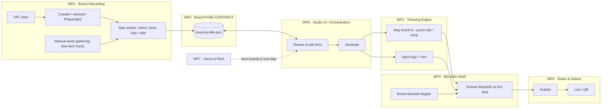

# BrandMatch — Hackathon H1/26

> Working name — change freely.

**Turn any customer URL into an on-brand IDV demo.**
Paste a prospect's website → get a shareable microsite that mimics their onboarding, with a live,
brand-themed **Jumio WebSDK** embedded at the identity-verification step. Built for sales & pre-sales
to lower the barrier to attention.

📄 **Full briefing:** open [`index.html`](./index.html) locally, or publish it via GitHub Pages (below).
This README mirrors that page so you can read everything straight from GitHub.

## 👋 New here? Start with these two
1. **[COLLABORATION.md](./COLLABORATION.md)** — who owns what, and the one rule. **Find your name, open your folder.**
2. **[CONTRIBUTING.md](./CONTRIBUTING.md)** — how to push your work *safely* (incl. a no-Git, website-only path for non-coders).

Your track lives in its own folder, each with a README telling you your first move:
[`/engine`](./engine) · [`/microsite`](./microsite) · [`/studio`](./studio) · [`/harvest`](./harvest) · [`/brands`](./brands) · [`/pitch`](./pitch) · [`/messaging`](./messaging).
End-of-day, leave a note in [`HANDOFF.md`](./HANDOFF.md).

### 🛠️ For the build teams
- **[`customization-reference.md`](./customization-reference.md)** — the authoritative catalog of every
  WebSDK customization knob (342 tokens, ~45 template slots) + the ramp-generator algorithm. **WP1/3/4/6 start here.**
- **[`brand-profile.schema.json`](./brand-profile.schema.json)** — the validatable contract schema (light mode only for now).
- **[`brand-profile.sample.json`](./brand-profile.sample.json)** — a worked example to build against.

---

## The idea

In sales/pre-sales the hardest thing is getting a prospect to *care*. A generic demo says "here's our
product." A microsite that looks like *their own onboarding* says "here's **you**, with friction removed."

- **Problem** — cold demos don't land; a real integration takes an engineering team days.
- **Solution** — a one-click "showcase creator": capture a brand's look & feel → auto-theme the WebSDK →
  embed it in a brand-skinned onboarding microsite → share a link.
- **Wow** — "watch us do in 10 seconds what normally takes an integration team a week." It's real: the
  SDK is genuinely token-themeable.

---

## How it works — one artifact ties it all together

Everything hangs off a single file: [`brand-profile.sample.json`](./brand-profile.sample.json). The
harvesting team *produces* it; the theming engine *consumes* it; the microsite and UI read it.
**Lock this schema in the first two hours** and every team can build in parallel against mock data.

The **mapping layer** (brand → SDK) reuses what the WebSDK already supports:

| Brand profile field | Maps to in the WebSDK |
| --- | --- |
| `brand.colors.primary` | generated lightness ramp on `--jumio-sdk-color-primary1..7` |
| `brand.logo.light` / `.dark` | `<template id="jumio-logotype-light">` / `…-dark">` slots |
| `brand.typography` | font `<link>` + `--jumio-sdk-font-family` |
| `journey.idvStepIndex` | which step of the microsite stepper embeds the SDK |

---

## Scope — protect an "always-green" demo

The riskiest part (auto-crawling) must **never** break the demo. Build it as a ladder:

| Tier | What works | When |
| --- | --- | --- |
| 🟢 **Must** | Manual: fill the JSON by hand → Generate → themed SDK in a microsite → shareable link. **A complete demo on its own.** | Day 1 |
| 🟡 **Should** | Semi-auto: crawler pre-fills most fields, human nudges a few, then Generate. | Day 2 AM |
| 🔵 **Could** | Full-auto: URL in → JSON out → microsite, zero edits, for 2–3 hero brands. | Stretch |

---

## Architecture



---

## Work packages

| WP | Deliverable | Consumes → Produces | Level | Good for | Fallback |
| --- | --- | --- | --- | --- | --- |
| **WP2** Contract | JSON schema + 3 mock profiles + mapping rules | — → `brand-profile.json` | High | 1 senior, hour 1–2, then advises | Must exist first |
| **WP1** Harvesting | Auto extractor + manual gatherer | URL → assets → JSON | Low / High | Design detectives collect by hand; coder automates | Manual gathering always works |
| **WP3** Theming engine | JSON → CSS vars + logo/font injection | JSON → styled SDK | High | Strongest front-end dev (core) | Pre-built theme presets |
| **WP4** Microsite shell | Branded stepper that embeds the SDK | JSON → HTML/CSS | Mid | HTML/CSS-comfortable | One generic template, lightly skinned |
| **WP6** Studio UI | URL field + edit form + Generate | JSON ↔ UI | Mid / Low | Form-filling is low-tech | Raw JSON textarea + button |
| **WP5** Share | Publish + link / QR | microsite → URL | Mid | DevOps-ish | Local serve + screen-share |
| **WP7** Demo & pitch | Hero brands, script, slides, QA | everything → narrative | Low | Where non-coders shine | The safety net |

**Why this works for a distributed, mixed-skill team**

- **Contract-first → parallelism.** Once WP2 ships the schema + mocks (~hour 2), WP3/4/6 build against mocks with zero cross-dependency.
- **Mock-first → no blocking handoffs.** Nobody waits for the crawler; swap real JSON in for mock JSON on Day 2.
- **The JSON is the handoff token.** A region going offline hands off by committing an updated `brand-profile.json` + a one-line note.
- **Low-tech tracks are real work.** Manual harvesting (WP1) and demo prep (WP7) are on the critical path and need a browser, taste and domain sense — not code.

---

## Timeline — follow-the-sun, 2 days

- **Day 1 · Region A** — lock schema + 3 mocks + mapping rules; stand up WP3/WP4 skeletons against mock JSON.
- **↓ handoff** — commit schema + mocks + a one-line "next steps" note.
- **Day 1 · Region B** — microsite renders a themed SDK from mock JSON → **manual path GREEN**; WP7 picks hero brands, hand-builds their JSON.
- **Day 2 · Region A** — crawler auto-fills JSON; WP6 review/edit form online.
- **Day 2 · Region B** — polish hero-brand themes, wire up sharing, rehearse.
- **Day 2 · All** — freeze; rehearse the 3-minute demo twice.

> **Golden rule:** by end of Day 1 you must be able to demo the *whole* flow with a manually-authored JSON. Everything Day 2 adds is upside, never a dependency.

---

## Risks & mitigations

- **Crawler flaky / sites block it** → manual edit fallback; **pre-cache hero brands' JSON** so the live demo never depends on a crawl.
- **Auto-extracted colors look ugly** → mapping generates a sensible ramp from one primary color; human nudges one value.
- **CORS / fonts / logo on dark vs light** → server-side asset fetch; Google-Fonts match + system fallback; light/dark logo variants already solved in the SDK.
- **Scope creep on "mimic their flow"** → don't clone their site; a brand-*skinned* 3-step stepper reads as "their flow" and is achievable.

---

## Get involved — find your track

- 🎨 **Not very technical** → WP1 (manual harvesting) or WP7 (demo & pitch): pick hero brands, collect logos/colors/fonts, hand-fill the JSON, write the story, QA.
- 🧩 **Can do HTML/CSS** → WP4 (microsite shell) or the WP6 form, against mock JSON.
- ⚙️ **Strong dev** → WP2 (schema), WP3 (theming engine), or the WP1 crawler.

👉 **Start here:** read [`brand-profile.sample.json`](./brand-profile.sample.json), then claim a WP in the team channel.

---

## Open decisions

- **Team & timezones** — who's in, and in which regions? (Drives the handoff chain.)
- **Hero brands** — which 2–3 recognizable brands do we guarantee look great?
- **Build target** — a new app inside the WebSDK monorepo (`apps/showcase-studio`) vs a standalone app importing the published `@jumio/websdk`.
- **Crawl strategy** — client-side fetch vs a small server-side extractor (avoids CORS).

---

## Publish it (GitHub Pages)

```bash
cd ~/Documents/Hackathon-H1-26
git init
git add .
git commit -m "BrandMatch hackathon briefing — first draft"
# create an EMPTY repo on github.com first, then:
git remote add origin https://github.com/<you>/Hackathon-H1-26.git
git branch -M main
git push -u origin main
```

Then on GitHub: **Settings → Pages → Build and deployment → Source: Deploy from a branch → `main` / `root` → Save.**
Your site goes live at `https://<you>.github.io/Hackathon-H1-26/` within a minute or two.

> ⚠️ **Access note:** GitHub Pages on a personal/free repo is **public**. If colleagues-only is required,
> keep the repo **private** and have people read this `README.md` on GitHub directly (Mermaid renders there),
> or host `index.html` on an internal server. Private Pages needs GitHub Enterprise.

### Run locally
Just open `index.html` in a browser. (The Mermaid diagram loads from a CDN, so you need internet.)
